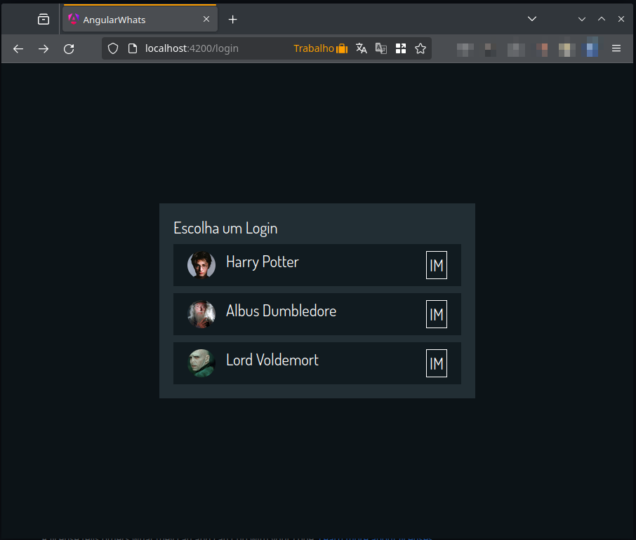
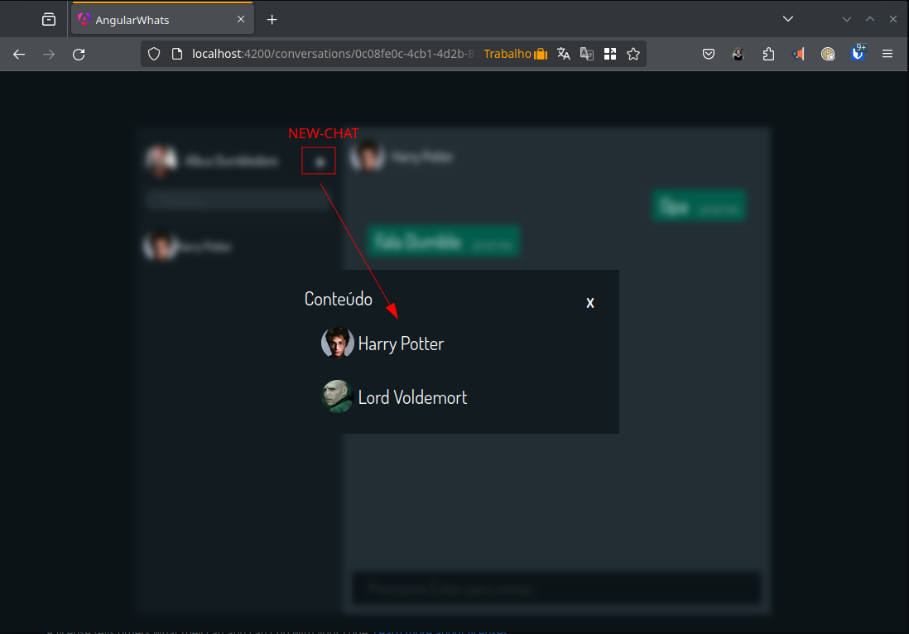
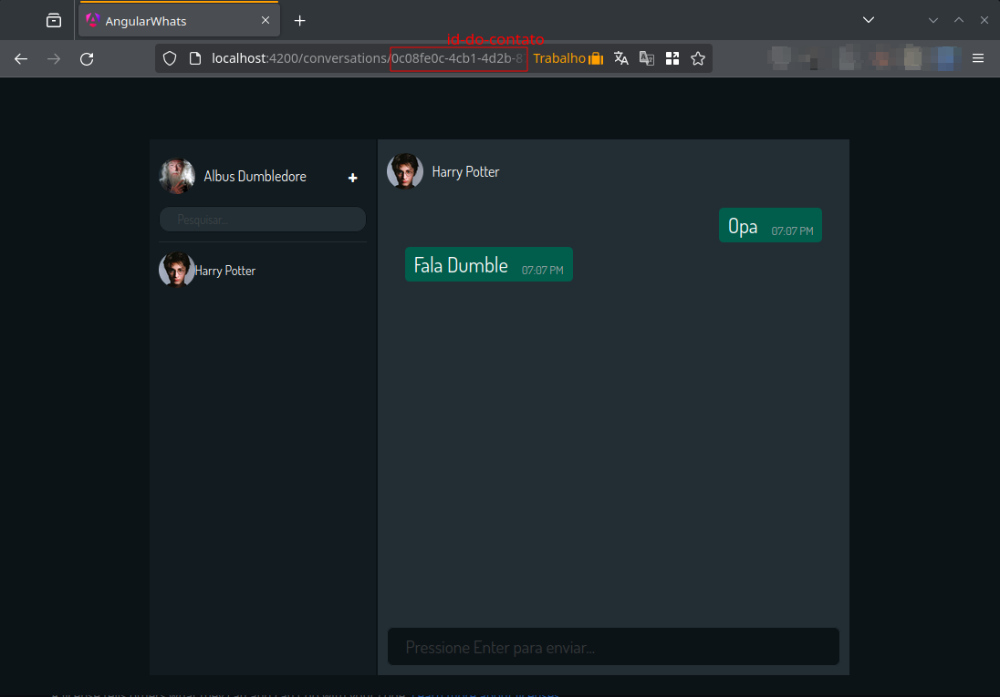

# Clone do WhatsApp - Projeto Angular

### Login Page (select your user)


### New Conversation Page (send message to)


### Conversation Page (conversation)



## Pré-Requisitos

Antes de tudo, confira se você tem o Node.js e o npm instalados.

## Instalação

Para botar a mão na massa com este projeto, siga estes passos:

1. Clone o repositório.
2. No terminal, vá até a pasta do projeto.
3. Rode `npm i` para instalar as dependências.

## Rodando o Projeto

Com as dependências no lugar, é só iniciar:

```bash
npm start
```

Pronto! Acesse `http://localhost:4200` no navegador e veja a mágica acontecer.

Repo-Back: https://github.com/samuk10/Whatsapp-Dotnet-Backend

## Projeto feito na Live do _Cristian William Dev_

Fique por dentro de cada detalhe do desenvolvimento. Confira as lives na [playlist do YouTube](https://www.youtube.com/playlist?list=PLMFE0Mu3BVy76T7bZw773jwi329Wl5TMu)